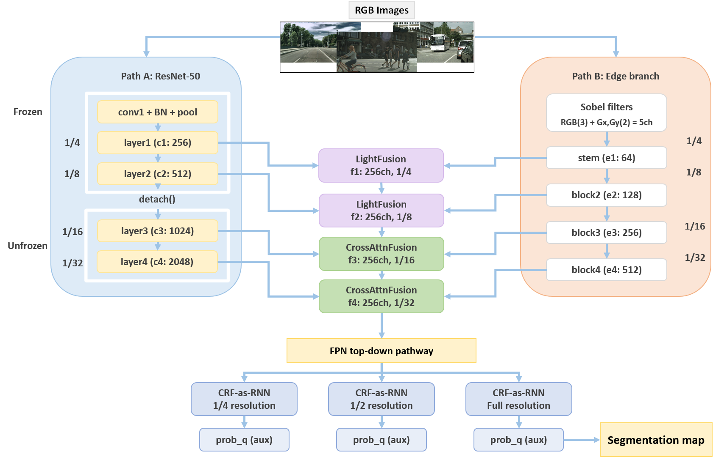

# DualPathCRFNet: End-to-End Learnable CRF with Edge-Aware Fusion for Semantic Segmentation

**Course:** CSE756 - Probabilistic Graphical Models  
**Institution:** BRAC University, Dhaka, Bangladesh  


---
<video src="Video/0007_seg.mp4" width="100%" controls autoplay loop muted></video>
---

## Overview

DualPathCRFNet is a unified end-to-end trainable semantic segmentation framework designed to address three major limitations of existing approaches:

- **Boundary insensitivity** - standard encoders suppress high-frequency edge information
- **Spatially inconsistent predictions** - pixel-wise classifiers ignore label dependencies
- **Suboptimal multi-stream fusion** - naive concatenation/addition fails to arbitrate between structurally different feature sources

The architecture combines a ResNet-50 semantic backbone (Path A) with a dedicated frequency-aware edge branch (Path B) that processes Sobel gradient responses alongside the RGB signal. A scale-adaptive fusion strategy applies lightweight LightFusion at fine spatial scales and bidirectional CrossAttnFusion at coarse scales. The fused features are decoded through an FPN-style top-down pathway and progressively refined by CRF-as-RNN modules cascaded at three resolutions (1/4, 1/2, and full), enforcing spatial label consistency from global region coherence down to sharp boundary localization.

---

## Results

Evaluated on the **Cityscapes validation set**:

| Metric | Before CRF | After CRF |
|---|---|---|
| mIoU | 68.60% | **70.52%** |
| mDice | 80.09% | **81.62%** |
| Pixel Accuracy | - | **94.9%** |
| Parameters | - | 34.32M |
| Model Size | - | 391 MB |
| Inference Time | - | 103.2 ms/image |

Cross-domain zero-shot evaluation on **KITTI** driving footage confirmed generalizability of the learned representations to unseen driving scenarios.

---

## Architecture



---

## Dataset

The augmented Cityscapes dataset (15,088 image-mask pairs) used for training is available on Kaggle:

🔗 [Cityscapes Augmented Dataset](https://www.kaggle.com/datasets/jawadulkarim117/cityscapes/data)

**Augmentation pipeline applied to the training set:**
1. Horizontal flipping (2,975 → 5,950 pairs)
2. Photometric enhancement - gray-world white balance + CLAHE (clip limit 2.5, 8×8 grid), filtered by perceptual hash (Hamming distance > 9)
3. Center cropping - 1440×720 output discarding vehicle hood region

The validation set remains the original 500 unaugmented Cityscapes pairs.

---

## Training Configuration

| Hyperparameter | Value |
|---|---|
| Input resolution | 512 × 1024 |
| Batch size | 4 |
| Optimizer | AdamW |
| Base learning rate | 1 × 10⁻⁴ |
| Backbone learning rate | 3 × 10⁻⁵ (0.3× base) |
| Weight decay | 1 × 10⁻⁴ |
| LR schedule | Cosine annealing + linear warmup (5 epochs) |
| Total epochs | 60 (early stopping patience: 5) |
| Mixed precision | FP16 |
| Gradient clipping | Max norm 1.0 |
| Auxiliary loss weight | 0.4 |
| Edge loss weight | 0.2 |
| CRF iterations (T) | 5 |
| CRF kernel size (K) | 5 × 5 |

Best checkpoint at **epoch 22**.

---

## Loss Function

```
L_total = L_CE(prob_f) + λ_aux · [L_CE(prob_q) + L_CE(prob_h)] + λ_edge · L_BCE(edge_pred)
```

where `λ_aux = 0.4` and `λ_edge = 0.2`.

---

## Qualitative Results

**Cityscapes validation scenes** - input, predicted mask, and overlay:

The model achieves strong performance on dominant classes (road: IoU 0.972, sky: 0.943, car: 0.932, vegetation: 0.913) while structurally thin classes (wall: 0.441, fence: 0.479, pole: 0.565) remain challenging due to class imbalance.

**KITTI zero-shot inference video:**  
🎥 [View on Google Drive](https://drive.google.com/drive/folders/1xSBRb6HHgNF29E_rqHqHfapDdWPtAJF8?usp=sharing)

---


## Limitations & Future Work

- Underperformance on rare/thin classes (wall, fence, pole, train) due to class imbalance - future work will explore class-balanced loss and online hard example mining
- CRF fixed kernel size (K=5) limits long-range pairwise interactions - deformable convolutions or sparse attention could extend the effective receptive field
- Inference time (103.2 ms/image) precludes real-time deployment - CRF distillation into a single lightweight module is planned
- Backbone upgrade to Swin Transformer or ConvNeXt expected to yield gains on ambiguous mid-range classes
- Evaluation on ADE20K and PASCAL VOC planned to assess generalizability beyond urban driving


---

